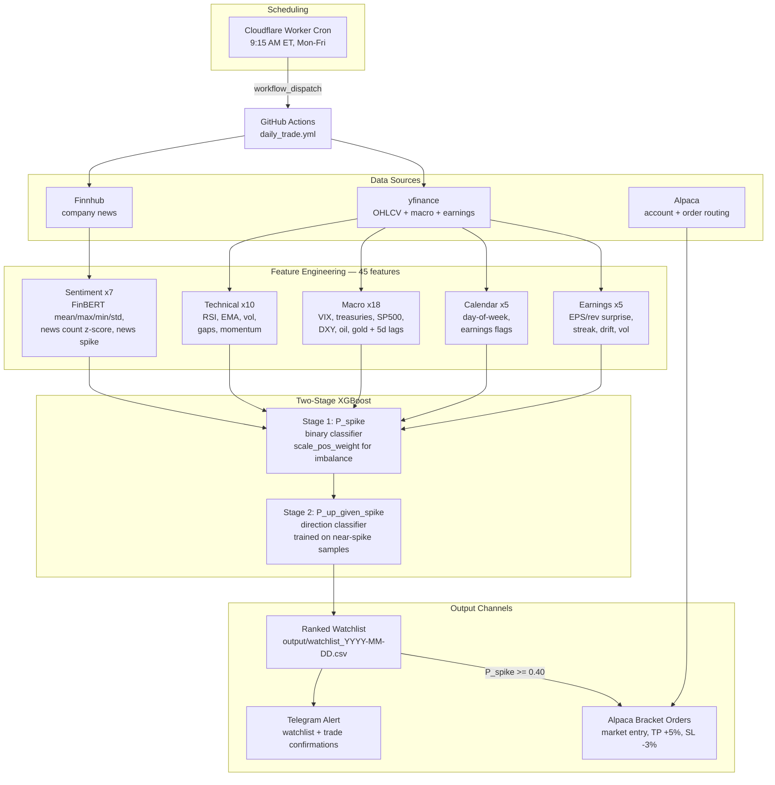

# Pre-Market Spike Detector v2

A Python pipeline that predicts which stocks will experience significant intraday price spikes before market open. Uses a two-stage XGBoost model with FinBERT sentiment analysis, adaptive per-ticker thresholds, and 45 features spanning sentiment, technical, macro, earnings, and calendar signals.

**Last updated:** May 22, 2026

## How It Works

Every trading day at **9:15 AM ET** (15 minutes before the open), the pipeline:

1. Fetches overnight news headlines from Finnhub and scores them with FinBERT
2. Pulls OHLCV history and macro indicators (VIX, treasuries, FX, commodities)
3. Computes 45 features from trailing OHLCV, macro data, calendar, and earnings history
4. Runs a two-stage XGBoost model:
   - **Stage 1** predicts whether a spike will occur (binary)
   - **Stage 2** predicts the direction — up or down (binary)
5. Outputs a ranked watchlist, sends it to Telegram, and places bracket orders via Alpaca for tickers above the trade threshold

**Important:** This is not a price predictor. It classifies whether today's session will produce a large intraday move relative to the stock's own volatility, using only data available before 9:30 AM ET.

## System Architecture



## Repo Layout

```
.
├── config.py              # Universe, feature columns, XGBoost params, risk limits
├── features.py            # Feature engineering (technical, macro, sentiment, earnings, calendar)
├── model.py               # Two-stage XGBoost model + time-series split
├── news.py                # Finnhub client + FinBERT scorer (disk-cached)
├── predict/
│   ├── spike_detector.py  # Main pipeline — predict + --retrain modes
│   ├── trade.py           # Alpaca bracket order execution
│   ├── notify.py          # Telegram alerts (watchlist + trade confirmations)
│   └── run_daily.sh       # Wrapper used by GitHub Actions
├── backtest/
│   ├── backtest.py        # Historical model performance
│   ├── backtest_strategy.py  # Strategy backtest with TP/SL
│   ├── validate_today.py  # Out-of-sample validation against today's actuals
│   └── validate_week.py   # Week-over-week validation
├── data/                  # Cached news, earnings, OHLCV, trained model
├── output/                # Daily watchlists, trade logs, validation reports
└── .github/workflows/
    ├── daily_predict.yml  # Prediction-only run (no trades)
    ├── daily_trade.yml    # Prediction + Alpaca paper trades
    └── retrain.yml        # Weekly model retrain
```

## Quick Start

### 1. Set Up Environment

```bash
python3 -m venv venv
source venv/bin/activate
pip install -r requirements.txt
```

### 2. Set API Keys

Create a `.env` file (see existing `.env` for the keys used):

```
FINNHUB_API_KEY=...
ALPACA_API_KEY=...
ALPACA_SECRET_KEY=...
TELEGRAM_BOT_TOKEN=...
TELEGRAM_CHAT_ID=...
```

### 3. Train the Model

```bash
python predict/spike_detector.py --retrain
```

Downloads 2 years of OHLCV data for 60 tickers, fetches overnight news from Finnhub, scores headlines with FinBERT, and trains the two-stage XGBoost model with time-series validation. Cached responses live under `data/` so subsequent retrains are fast.

### 4. Run Daily Predictions

```bash
python predict/spike_detector.py        # Generate watchlist only
python predict/trade.py --dry-run       # Show signals + simulated orders
python predict/trade.py --paper         # Paper trading via Alpaca (default)
python predict/trade.py --live          # Live trading — requires explicit flag
```

### 5. Validate and Backtest

```bash
python backtest/validate_today.py       # Compare today's predictions to actuals
python backtest/validate_week.py        # Roll up the past week
python backtest/backtest.py             # Last 6 months of model performance
python backtest/backtest_strategy.py    # Full strategy backtest with TP/SL
```

## Two-Stage Model Architecture

### Stage 1: Spike Detection (Binary)

Predicts P(spike) — whether any significant move will occur. Trained with `scale_pos_weight` to handle the ~88% flat / 12% spike class imbalance. **Excludes `realized_vol_20d`** from its feature set to prevent the "always flag volatile stocks" bias — `vol_z_score` (relative volatility) captures regime shifts without the absolute-level shortcut.

### Stage 2: Direction Classification (Binary)

Predicts P(up | spike) — if a spike happens, which way. Trained on **spike + near-spike samples** (days where the return exceeded 50% of the spike threshold) rather than all samples. This gives the model ~10,000 training rows of meaningful directional moves without diluting signal with flat days that would bias it bearish. Heavily regularized (`max_depth=3`, high `min_child_weight`, strong L1/L2) to combat the 92% val → 50% live overfitting seen in the v1 model.

### Inference

```
p_spike = Stage1.predict_proba(X)
p_up    = p_spike * Stage2.predict_proba(X)
p_down  = p_spike * (1 - Stage2.predict_proba(X))
p_flat  = 1 - p_spike
```

### Adaptive Spike Threshold

Each ticker gets its own threshold based on its historical volatility:

```
threshold = max(20-day avg |intraday return| * 1.5, 3%)
```

NVDA's threshold might be 5%, while AAPL's might be 3%. This prevents volatile stocks from always being labeled as "spiking."

## Features (45 total)

### Sentiment (7)
Overnight news headlines scored with [ProsusAI/FinBERT](https://huggingface.co/ProsusAI/finbert). Mean, max, min, std of sentiment scores, raw news count, z-scored news volume (abnormal attention signal), and a binary news-spike flag (3x normal volume).

### Technical (10)
Previous close, RSI-14, EMA-10, 20-day realized volatility, volatility z-score, 10-day average volume, previous day return/range, 3-day momentum, and overnight gap. All shifted to avoid lookahead.

### Macro (18)
VIX level + daily change, 10Y treasury yield, yield curve spread (10Y minus 3M), SP500 1-day and 5-day returns, sector ETF 5-day momentum, USD index change, crude oil change, gold change, **plus 8 lagged 3-day/5-day variants** so the model can see sustained regime shifts vs single-day blips.

### Calendar (5)
Day of week, Monday/Friday flags, days to next earnings, earnings day flag.

### Earnings (5)
Most recent EPS surprise %, revenue surprise %, consecutive beat/miss streak, post-earnings 1-day drift, and average absolute return on earnings days (last 4 quarters).

### Planned (not yet implemented)
- Live pre-market price/volume features (requires paid Alpaca data tier)
- Options flow / unusual options activity (requires paid feed)

## Ticker Universe (60 stocks)

| Sector | Tickers |
|--------|---------|
| Mega-Cap Tech | NVDA, AAPL, MSFT, GOOGL, AMZN, META, TSLA |
| Semiconductors | AMD, MU, AVGO, QCOM, MRVL, ARM, INTC, ON, SMCI |
| Growth / AI / Cloud | PLTR, IONQ, RGTI, SNOW, ANET, CRWD, NET |
| Biotech / Healthcare | MRNA, BNTX, CRSP, DXCM, ISRG, VRTX |
| Energy | XOM, CVX, OXY, FSLR, ENPH |
| Financials | JPM, GS, COIN, HOOD, XYZ, SOFI |
| Consumer / Retail | NFLX, DIS, NKE, BABA, JD |
| Industrial / EV | RIVN, LCID, LI, BA, CAT |
| Meme / Speculative | GME, AMC |
| Sector ETFs | SMH, QTUM, XLK, XLF, XLE, XBI, XLY, XLI |

## Trading Strategy

Configured in `config.py`:

| Setting | Value | Purpose |
|---|---|---|
| `TRADE_THRESHOLD` | 0.40 | Minimum P(spike) to enter a position |
| `MAX_POSITIONS_PER_DAY` | 3 | Cap on simultaneous positions |
| `MAX_POSITION_PCT` | 10% | Per-position cap as % of equity |
| `MAX_DAILY_LOSS_PCT` | 5% | Circuit breaker — stop trading if account drops 5% intraday |
| `TAKE_PROFIT_PCT` | +5% | Bracket-order take-profit |
| `STOP_LOSS_PCT` | -3% | Bracket-order stop-loss |
| `MAX_CONSECUTIVE_TICKER_DAYS` | 3 | Don't trade same ticker more than 3 days in a row |

Alpaca handles bracket exits server-side, so no intraday monitoring process is needed.

## Automation

### Cloudflare Worker → GitHub Actions

A Cloudflare Worker cron fires at **9:15 AM ET on weekdays** and triggers GitHub Actions workflows via `workflow_dispatch`. Three workflows live in `.github/workflows/`:

- **`daily_predict.yml`** — Predictions only (no trades), sends watchlist to Telegram
- **`daily_trade.yml`** — Predictions + paper trades + Telegram confirmations (the production daily run)
- **`retrain.yml`** — Weekly model retrain, uploads model artifact for the daily runs to download

Required GitHub Secrets: `FINNHUB_API_KEY`, `ALPACA_API_KEY`, `ALPACA_SECRET_KEY`, `TELEGRAM_BOT_TOKEN`, `TELEGRAM_CHAT_ID`

### Telegram

Two notifications per run:
1. **Prediction watchlist** — sent right after `spike_detector.py` finishes
2. **Trade confirmations** — sent after `trade.py` places orders

## Recent Changes

### May 2026 — Restructure + Reliability

- Reorganized into `predict/` and `backtest/` folders for clarity
- Added Telegram trade confirmations as a separate message after order placement
- Moved scheduling from in-repo cron to Cloudflare Worker → GitHub Actions (frees us from GitHub's flaky cron timing)
- Added disk caching for OHLCV downloads to speed up retrains
- Shifted daily run from ~7 AM to **9:15 AM ET** to capture full overnight news flow + BMO earnings while leaving a 15-minute buffer to the open

### Model Improvements

- **Dropped `realized_vol_20d` from Stage 1.** It accounted for 10.3% of feature importance — 2x the next feature — teaching the model "volatile stock = spike" rather than detecting actual spike conditions. `vol_z_score` remains to capture relative volatility shifts.
- **Stage 2 now trains on spike + near-spike samples** instead of all samples. The previous approach (training on all ~29,000 rows) introduced a bearish bias from the 88% flat days. The new approach uses ~10,000 rows of days with meaningful directional moves, improving direction accuracy from 65% to 92.6% on the validation set.
- **Stage 2 heavily regularized** — `max_depth=3`, `min_child_weight=20`, `gamma=1.0`, `reg_alpha=1.0`, `reg_lambda=5.0` — to combat overfitting (was 92% val / 50% live).
- **Added `scale_pos_weight`** for Stage 1 class imbalance instead of manual sample weights.

### Feature Expansion

- **+8 lagged macro features** — 3-day and 5-day variants of VIX, DXY, oil, gold, treasury, SP500 — so single-day blips don't drown out sustained regime shifts
- **+5 earnings features** — EPS surprise, revenue surprise, streak, post-earnings drift, earnings-day volatility
- **+5 macro features** — yield curve spread, USD index, crude oil, gold, SP500 5-day return
- **+2 sentiment features** — news count z-score, news spike flag
- **+2 technical features** — volatility z-score, overnight gap

### Expanded Universe

27 → 60 tickers across biotech, energy, financials, consumer, industrial, and more semiconductors. Training data roughly doubled from ~13,500 to ~30,000 rows.

## Design Decisions

- **No lookahead bias** — every feature uses only data available before 9:30 AM ET
- **Time-series validation** — most recent 20% of data as validation (no shuffle)
- **Adaptive thresholds** — per-ticker spike definition based on historical volatility
- **Aggressive caching** — Finnhub news, earnings data, and OHLCV cached to disk under `data/`
- **Graceful degradation** — missing earnings or news data defaults to 0, model still runs
- **Server-side bracket exits** — Alpaca manages TP/SL, no intraday process needed
